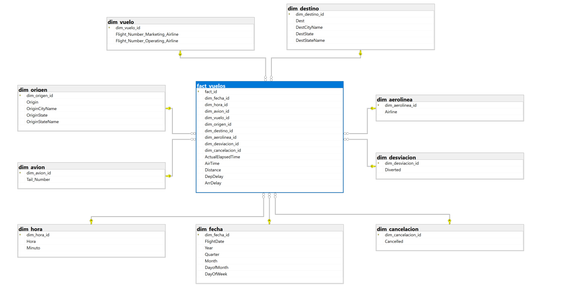

# Análisis de Datos de Vuelos

## Introducción

Este proyecto tiene como objetivo analizar datos históricos de vuelos para identificar patrones de retrasos, cancelaciones y desvíos. Con una base de datos sólida, se busca proporcionar insights que respalden decisiones estratégicas y operativas orientadas a optimizar la programación de vuelos, la asignación de aeronaves y la comunicación con los pasajeros. Asimismo, el modelo de datos facilita la toma de decisiones tanto para aerolíneas (reducción de costos y mejora del servicio) como para autoridades de aviación civil (gestión del tráfico aéreo y mejora de la seguridad operativa).

## Marco Teórico

La Inteligencia de Negocios (Business Intelligence, BI) es un enfoque que integra metodologías, procesos y herramientas tecnológicas para transformar datos en información útil para la toma de decisiones organizacionales. Según Turban et al. (2011), BI se define como “una arquitectura que combina almacenes de datos, herramientas analíticas y sistemas de presentación para ofrecer acceso a la información empresarial crítica”.  Esta visión coincide con lo expuesto por Páez Bravo et al. (2019), quienes destacan que BI no solo se centra en el almacenamiento de datos, sino en el descubrimiento de patrones relevantes para el negocio.

De acuerdo con IBM, el BI “ingiere datos del negocio y los presenta en vistas fáciles de usar, como informes, paneles, tablas y gráficos”, facilitando así la generación de decisiones más informadas (IBM, s.f.). Por su parte, Tableau la concibe como un enfoque integral que “combina análisis de negocios, minería de datos, visualización, infraestructura de datos y mejores prácticas” con el fin de transformar tanto datos históricos como actuales en ventajas competitivas (Tableau, s.f.).

### Evolución hacia Business Intelligence & Analytics (BI&A)

En investigaciones recientes, el concepto de BI se ha ampliado hacia Business Intelligence and Analytics (BI&A). Este enfoque integra técnicas de análisis predictivo, aprendizaje automático y procesamiento de grandes volúmenes de datos (big data), lo que permite generar no solo insights retrospectivos, sino también prescriptivos y prospectivos (Duy et al., 2017).

De esta forma, el BI deja de ser una herramienta limitada a reportes estáticos para convertirse en una plataforma dinámica y adaptativa, capaz de responder a nuevas preguntas de negocio conforme surgen. Esto se complementa con funcionalidades de análisis visual, esquemas de autoexploración de datos (self-service BI) y arquitecturas escalables que permiten mayor autonomía y flexibilidad.

### Componentes y Arquitectura de un Sistema BI

Un sistema de BI se compone típicamente de los siguientes elementos interrelacionados:

- Fuentes de datos operacionales: sistemas transaccionales donde se generan y almacenan los datos crudos.
- Procesos ETL: extracción, transformación, limpieza e integración de datos hacia un repositorio centralizado.
- Data Warehouse / Datamarts: almacenes estructurados diseñados para el análisis, no para la transaccionalidad.
- Modelado dimensional / OLAP: organización de los datos en hechos y dimensiones, aplicando esquemas estrella o copos de nieve.
- Herramientas de consulta y visualización: paneles de control, informes interactivos, minería de datos y análisis.
- Gobernanza y calidad de datos: mecanismos que aseguran integridad, consistencia y accesibilidad.

### Modelado Dimensional

Kimball Group propone un proceso de diseño dimensional en cuatro etapas: (1) identificación del proceso de negocio, (2) definición del grano, (3) identificación de dimensiones y hechos, y (4) definición de jerarquías y agregaciones (Kimball Group, s.f.).

En este contexto, una tabla de hechos (fact table) contiene las medidas cuantitativas del negocio (por ejemplo, los minutos de retraso en vuelos), vinculadas a dimensiones mediante claves foráneas. Estas medidas deben ser numéricas para permitir su correcta agregación (IBM, s.f.).

Las dimensiones, por su parte, almacenan atributos descriptivos (aerolínea, aeropuerto, fecha, entre otros) que facilitan segmentar y analizar los hechos desde múltiples perspectivas. En arquitecturas modernas se promueve el uso de dimensiones conformadas (shared dimensions), lo que favorece la consistencia y reutilización en distintos datamarts (Microsoft, 2024).

## Descripción de la Empresa

### Contexto de la Industria Aérea

La industria aérea se caracteriza por su alta complejidad operativa y un entorno competitivo intenso. El desempeño de aerolíneas y aeropuertos depende de la puntualidad, la tasa de cancelaciones y desvíos y la eficiencia de las operaciones en tierra. Tanto pasajeros como agencias y autoridades reguladoras exigen previsibilidad, fiabilidad y seguridad en el servicio.

Los retrasos y cancelaciones generan costos directos (combustible adicional, reprogramación de tripulaciones, penalidades contractuales) y costos intangibles (deterioro de la reputación, menor satisfacción y lealtad del cliente). En este contexto, disponer de capacidades analíticas para identificar patrones, explicar causas raíz y anticipar eventos es crítico para la competitividad.

### Problema Específico con el Dataset Seleccionado

Las empresas aéreas enfrentan dificultad de identificar con claridad la proporción de vuelos retrasados, cancelados o desviados debido al alto volumen, variabilidad y complejidad operativa de los datos que generan diariamente. Para este proyecto se emplea el “Flight Delay Dataset 2018–2022” (Kaggle), que reúne información histórica masiva de vuelos (horarios programados y reales, códigos de aerolíneas, aeropuertos de origen y destino, métricas de retraso/cancelación, distancia, entre otros).

El problema que se busca resolver puede resumirse en los siguientes puntos:

- Volumen y dispersión de datos: información operativa en grandes volúmenes y múltiples archivos/fuentes dificulta su explotación.
- Baja eficiencia para responder consultas de negocio: preguntas como “¿qué aerolíneas tuvieron mayor tasa de desvíos en rutas en los últimos 6 meses?” demandan procesamiento intensivo y no cuentan con estructuras analíticas optimizadas.
- Limitaciones de reporting tradicional: herramientas como Excel no escalan y dificultan el cruce eficiente de múltiples dimensiones (tiempo, aeropuerto, aerolínea, estado del vuelo, distancia).
- Decisiones operativas dependientes de evidencia: programación de vuelos y asignación de aeronaves necesitan insights históricos confiables y consistentes.

### Objetivo del Proyecto

Construir un datamart que habilite consultas rápidas, agregaciones multidimensionales y la generación de KPIs relevantes para la gestión operacional.

### Preguntas de Negocio y Decisiones Esperadas

- ¿Qué aerolíneas exhiben mejor puntualidad?
- ¿Qué aeropuertos acumulan más minutos de demora?
- ¿Cuál es la tasa de cancelación promedio por aerolínea, mes y aeropuerto?

### Decisiones Operativas que Habilita:

- Ajustar la programación en rutas frecuentemente problemáticas.
- Incrementar buffers de giro en aeropuertos congestionados o en horarios críticos, es decir, aumentar el espacio de tiempo o físico entre procesos aeroportuarios para evitar la congestión en horas punta.
- Optimizar la asignación de flota para minimizar impactos ante picos de demanda o restricciones operativas.
- Focalizar iniciativas (mejora de procesos) en aerolíneas o rutas con peor desempeño.

### KPIs propuestos para el Datamart

- OTP (On-Time Performance): % de vuelos con salida/llegada dentro del umbral (p. ej., menos a 15 min).
- Tasa de cancelación: cancelaciones / vuelos programados.
- Demora por dimensión: por aeropuerto, aerolínea, ruta, franja horaria, día/mes/temporada.
- Vuelos afectados: proporción de vuelos con cualquier evento disruptivo (retraso>15 min, cancelación o desvío).
  
Estos KPIs se calcularán sobre tablas de hechos (vuelos) con dimensiones conformadas (fecha, aerolínea, tiempo) para permitir cortes consistentes y comparables.

### Resultados esperados
- Datamart consolidado y documentado, con esquema estrella y diccionario de datos.
- Dashboards para monitoreo operativo (tendencias, comparativos por aeropuerto/aerolínea/tiempo).
- Recomendaciones de mejora operativa basadas en evidencia.
  
### MODELAMIENTO DE DATA DIMENSIONAL

### Diccionario de Datos

### Fact Vuelos

| Columna            | Tipo  | Descripción                                                       |
| ------------------ | ----- | ----------------------------------------------------------------- |
| fact_id            | INT   | Identificador interno del registro en la tabla de hechos.         |
| dim_fecha_id       | INT   | Llave foránea hacia la dimensión de fecha.                        |
| dim_hora_id        | INT   | Llave foránea hacia la dimensión de hora (hora-minuto de salida). |
| dim_avion_id       | INT   | Llave foránea hacia información del avión.                        |
| dim_vuelo_id       | INT   | Llave foránea hacia dimensiones del número de vuelo.              |
| dim_origen_id      | INT   | Llave foránea hacia el aeropuerto origen.                         |
| dim_destino_id     | INT   | Llave foránea hacia el aeropuerto destino.                        |
| dim_aerolinea_id   | INT   | Llave foránea hacia la aerolínea.                                 |
| dim_desviacion_id  | INT   | Llave foránea hacia información de desvíos.                       |
| dim_cancelacion_id | INT   | Llave foránea hacia información de cancelación.                   |
| ActualElapsedTime  | FLOAT | Minutos totales transcurridos de operación del vuelo.             |
| AirTime            | FLOAT | Minutos reales en el aire.                                        |
| Distance           | FLOAT | Distancia del vuelo en millas.                                    |
| DepDelay           | FLOAT | Minutos de retraso al despegue.                                   |
| ArrDelay           | FLOAT | Minutos de retraso al aterrizaje.                                 |

### Dim_avion

| Columna      | Tipo          | Descripción                  |
| ------------ | ------------- | ---------------------------- |
| dim_avion_id | INT           | Identificador de avión (PK). |
| Tail_Number  | NVARCHAR(100) | Matrícula del avión.         |

### Dim_vuelo

| Columna                         | Tipo          | Descripción                           |
| ------------------------------- | ------------- | ------------------------------------- |
| dim_vuelo_id                    | INT           | Identificador del vuelo (PK).         |
| Flight_Number_Marketing_Airline | NVARCHAR(100) | Número de vuelo (código comercial).   |
| Flight_Number_Operating_Airline | NVARCHAR(100) | Número de vuelo operado (si difiere). |

### Dim_origen

| Columna         | Tipo          | Descripción                              |
| --------------- | ------------- | ---------------------------------------- |
| dim_origen_id   | INT           | Identificador de aeropuerto origen (PK). |
| Origin          | NVARCHAR(20)  | Código IATA (ej. LAX, JFK).              |
| OriginCityName  | NVARCHAR(200) | Nombre de la ciudad de origen.           |
| OriginState     | NVARCHAR(20)  | Código del estado.                       |
| OriginStateName | NVARCHAR(200) | Nombre del estado.                       |

### Dim_destino

| Columna        | Tipo          | Descripción                               |
| -------------- | ------------- | ----------------------------------------- |
| dim_destino_id | INT           | Identificador de aeropuerto destino (PK). |
| Dest           | NVARCHAR(20)  | Código IATA destino.                      |
| DestCityName   | NVARCHAR(200) | Ciudad destino.                           |
| DestState      | NVARCHAR(20)  | Estado destino (abreviado).               |
| DestStateName  | NVARCHAR(200) | Nombre del estado.                        |

### Dim_aerolinea
| Columna          | Tipo          | Descripción                      |
| ---------------- | ------------- | -------------------------------- |
| dim_aerolinea_id | INT           | ID interno de aerolínea (PK).    |
| Airline          | NVARCHAR(200) | Código o nombre de la aerolínea. |

### Dim_fecha

| Columna      | Tipo | Descripción                     |
| ------------ | ---- | ------------------------------- |
| dim_fecha_id | INT  | Identificador de la fecha (PK). |
| FlightDate   | DATE | Fecha del vuelo (YYYY-MM-DD).   |
| Year         | INT  | Año del vuelo.                  |
| Quarter      | INT  | Trimestre del año.              |
| Month        | INT  | Mes.                            |
| DayOfMonth   | INT  | Día del mes.                    |
| DayOfWeek    | INT  | Día de la semana (1–7).         |

### Dim_hora

| Columna     | Tipo | Descripción                 |
| ----------- | ---- | --------------------------- |
| dim_hora_id | INT  | Identificador de hora (PK). |
| Hora        | INT  | Hora (00–23).               |
| Minuto      | INT  | Minutos (00–59).            |

### Dim_cancelacion
| Columna            | Tipo        | Descripción                                     |
| ------------------ | ----------- | ----------------------------------------------- |
| id_cancelacion   | INT         | Clave sustituta para la cancelación del vuelo.  |
| Cancelled        | BIT         | Indicador de cancelación (1 = Sí, 0 = No).      |
| CancellationCode | VARCHAR(10) | Código de cancelación que especifica el motivo. |

### Dim_desviacion

| Columna            | Tipo | Descripción                        |
| ------------------ | ---- | ---------------------------------- |
| dim_cancelacion_id | INT  | Identificador de cancelación (PK). |
| Cancelled          | INT  | Indicador 0/1 de cancelación.      |

## Referencias

- **IBM**. (s.f.). ¿Qué es Business Intelligence (BI)? *IBM Think*. Recuperado de [https://www.ibm.com/mx-es/think/topics/business-intelligence](https://www.ibm.com/mx-es/think/topics/business-intelligence)
- **Mulla, R.** (robikscube). (s.f.). *Flight Delay Dataset 2018–2022* [Conjunto de datos]. Kaggle. Recuperado el 15 de septiembre de 2025, de [https://www.kaggle.com/datasets/robikscube/flight-delay-dataset-20182022](https://www.kaggle.com/datasets/robikscube/flight-delay-dataset-20182022)
- **Kimball, R.**, & **Ross, M.** (s.f.). *The Data Warehouse Toolkit: The Definitive Guide to Dimensional Modeling* (3rd ed.). Wiley
- **Microsoft**. (2024). Dimensional modeling in Fabric Data Warehouse. *Microsoft Learn*. Recuperado de [https://learn.microsoft.com/en-us/fabric/data-warehouse/dimensional-modeling-overview](https://learn.microsoft.com/en-us/fabric/data-warehouse/dimensional-modeling-overview)
- **Páez Bravo, F.**, **Peña Triana, L.**, & **Rodríguez, M.** (2019). *Modelo de Business Intelligence para la toma de decisiones*. Universidad Agustiniana.
- **Tableau**. (s.f.). ¿Qué es Business Intelligence? *Tableau Software*. Recuperado de [https://www.tableau.com/es-mx/learn/articles/business-intelligence](https://www.tableau.com/es-mx/learn/articles/business-intelligence)
- **Turban, E.**, **Sharda, R.**, **Delen, D.**, & **King, D.** (2011). *Business Intelligence: A Managerial Approach* (2nd ed.). Pearson.
- **Quoc Duy V.**, **Jaya T.**, **Shinyoung C.**, **Pradipta D.**, **Bong J.**, & **Lee S.** (2017). *Next generation business intelligence and analytics: A survey*. arXiv. Recuperado de [https://arxiv.org/abs/1704.0340](https://arxiv.org/abs/1704.0340)
- **DATASET** https://www.kaggle.com/datasets/robikscube/flight-delay-dataset-20182022
